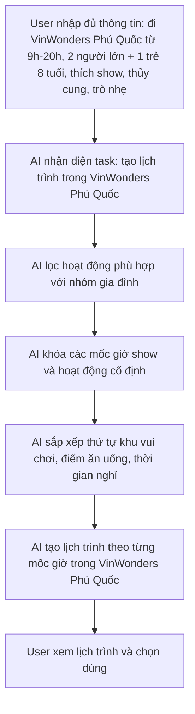
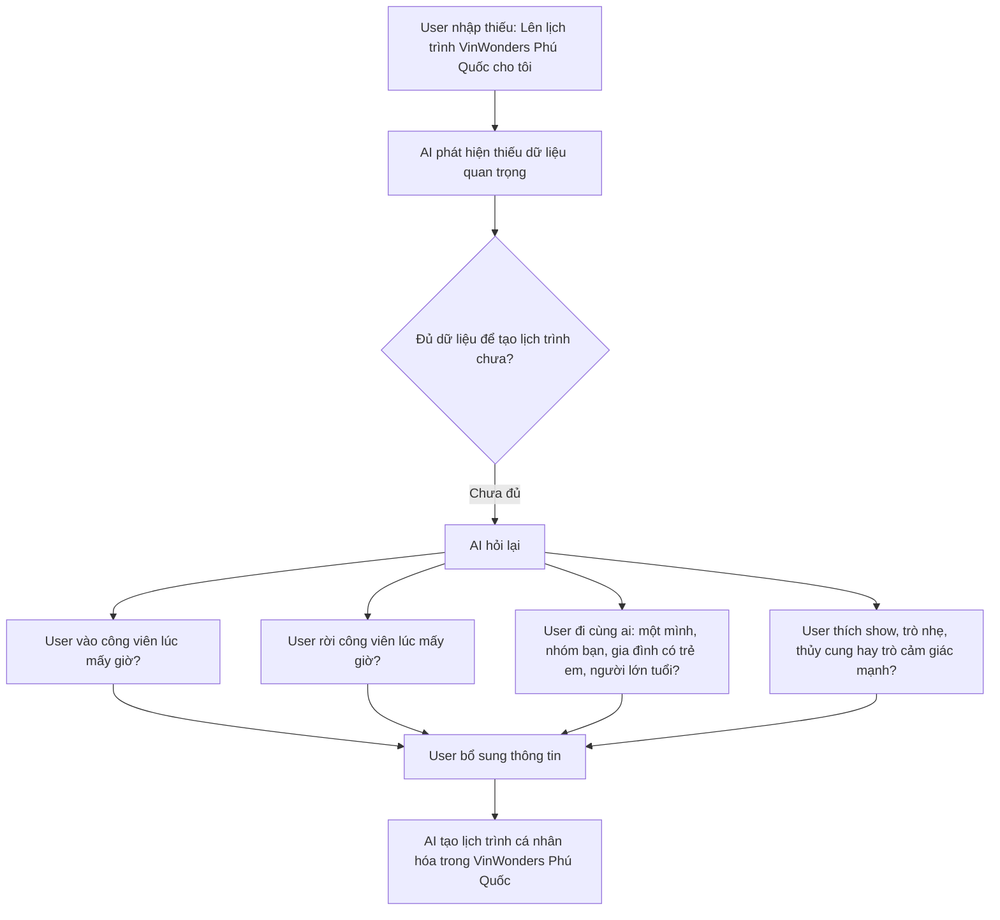
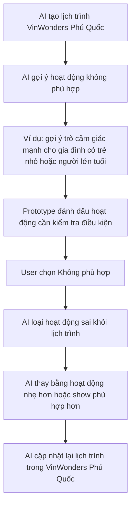
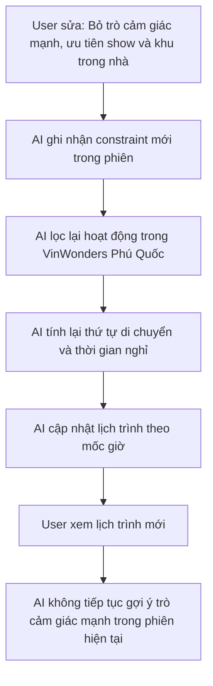

# Template — Thin SPEC Cuối Day 05

Thin SPEC không phải PRD đầy đủ. Đây là bản cam kết đủ rõ để sáng Day 06 nhóm build ngay.

## 1. Track, product/app và user

**Track:**  Travel & Hospitality
**Product/app thật:**  Lập lịch trình tham quan khám phá VinWonders (Vinpearl & Safari)
**User cụ thể:**  Khách đi VinWonders, đặc biệt là nhóm gia đình có trẻ em và người lớn tuổi, muốn có lịch trình cá nhân hóa theo mốc giờ để tối ưu trải nghiệm trong công viên.
**Nhóm có phải user thật không? Nếu không, khác ở đâu?**  Nhóm này là user thật, dựa trên nhu cầu phổ biến của khách tham quan VinWonders. Tuy nhiên, trong prototype, chúng ta sẽ giả định thông tin đầu vào để tập trung vào việc tạo lịch trình cá nhân hóa, thay vì thu thập dữ liệu thực tế từ user.


## 2. Evidence summary

| Evidence | Nguồn | User/pain nói lên điều gì? | SPEC phải đổi gì? |
|---|---|---|---|
| Nhiều khách đánh giá VinWonders Phú Quốc có diện tích lớn, nhiều khu vui chơi và hoạt động nên khó tự lên kế hoạch tham quan hiệu quả trong một ngày | Google Reviews, TripAdvisor, các bài review và kinh nghiệm du lịch VinWonders Phú Quốc | Khách mất nhiều thời gian quyết định nên đi đâu trước, dễ bỏ lỡ các điểm nổi bật hoặc di chuyển không tối ưu | AI phải tự động sắp xếp lịch trình theo mốc giờ và tối ưu thứ tự tham quan giữa các khu vực |
| Các gia đình có trẻ em và người lớn tuổi phải cân nhắc độ tuổi, chiều cao và khả năng vận động khi lựa chọn hoạt động | Review của khách du lịch gia đình trên các diễn đàn và hội nhóm du lịch | Không phải hoạt động nào cũng phù hợp với mọi thành viên trong đoàn; gợi ý sai sẽ làm giảm trải nghiệm và vỡ lịch trình | Prototype phải có constraint filter theo độ tuổi, chiều cao, sức khỏe và mức độ vận động trước khi tạo lịch trình |
| Khách thường bỏ lỡ các show diễn hoặc đến không đúng giờ do không nắm rõ lịch biểu diễn trong ngày | Blog du lịch, review trải nghiệm và hướng dẫn tham quan VinWonders Phú Quốc | Các show diễn là điểm nhấn quan trọng nhưng khó tự sắp xếp nếu không có kế hoạch từ trước | AI phải ưu tiên khóa các mốc giờ show diễn và hoạt động cố định trước khi sắp xếp các hoạt động còn lại |

## 3. Pain statement

```text
Khách hàng đi VinWonders thường gặp khó khăn trong việc lên lịch trình tham quan cá nhân hóa, đặc biệt là khi đi cùng nhóm gia đình có trẻ em và người lớn tuổi. Họ phải tự tìm hiểu và sắp xếp các hoạt động phù hợp với sở thích và giới hạn của từng thành viên, dẫn đến mất thời gian và trải nghiệm không tối ưu. Bằng chứng chính là nhiều review trên các trang du lịch phàn nàn về việc khó khăn trong việc lên kế hoạch tham quan hiệu quả tại VinWonders.
```

## 4. Build slice

```text
Cho khách hàng đang [lên lịch trình tham quan tại VinWonders Phú Quốc cùng nhóm gia đình có trẻ em và người lớn tuổi],

prototype sẽ dùng AI để [tự động phân tích thông tin đầu vào (thời gian, thành viên, sở thích) và sắp xếp các hoạt động phù hợp vào các mốc giờ cố định],

tạo ra [bản lịch trình tham quan cá nhân hóa chi tiết theo từng mốc giờ (bao gồm khu vui chơi, show diễn, điểm ăn uống, thời gian nghỉ và lý do gợi ý)],

và xử lý [nguy cơ AI gợi ý sai hoạt động không phù hợp với độ tuổi, chiều cao hoặc sức khỏe của trẻ em/người lớn tuổi làm vỡ lịch trình] bằng [cơ chế bộ lọc ràng buộc (constraint filter), hỏi xác nhận lại thông tin (ask again), gắn nhãn cảnh báo điều kiện (warning label) và cung cấp tính năng đổi nhanh hoạt động không phù hợp].
```

## 5. Auto/Aug decision

Chọn một:

- [ ] **Augmentation:** AI gợi ý/draft/phân loại, user quyết cuối.
- [x] **Conditional automation:** AI tự làm trong case hẹp; case mơ hồ/rủi ro chuyển người.
- [ ] **Automation:** AI tự quyết và tự hành động.

**Lý do chọn:**  
Prototype **tự tạo lịch trình theo mốc giờ** khi user nhập đủ thời gian, nhóm đi cùng và sở thích (happy path) — đây là tự động hóa phần sắp xếp, không chỉ gợi ý rời rạc. Tuy nhiên **không** để AI tự quyết và tự hành động end-to-end (Automation): user vẫn **xem, chọn dùng, sửa hoặc từ chối** từng hoạt động; AI không đặt vé hay ép lịch cuối cùng.

Điều kiện chuyển về người:
- **Thiếu dữ liệu** → AI không tạo lịch ngay, hỏi lại (low-confidence).
- **Rủi ro an toàn / độ tuổi** (trẻ em, người lớn tuổi, sức khỏe) → constraint filter + nhãn “cần kiểm tra điều kiện”; hoạt động nghi ngờ cần user xác nhận hoặc bấm “không phù hợp”.
- **Sai hoặc đổi ý** → user sửa constraint; AI chỉ tính lại trong phạm vi user chấp nhận (correction / failure path).

Không chọn thuần **Augmentation** vì mục tiêu Day 06 là deliverable **bản lịch trình hoàn chỉnh theo giờ**, không dừng ở draft bullet gợi ý. Không chọn **Automation** vì hậu quả gợi ý sai hoạt động (mất thời gian, lịch vỡ, rủi ro an toàn) vượt mức chấp nhận cho nhóm gia đình — cần human-in-the-loop trước khi coi lịch là “chốt”.

**Human role:** **reviewer** (duyệt lịch trình trước khi dùng) · **decider** (chọn dùng / không phù hợp / sửa constraint) · **trainer** (bổ sung thông tin khi AI hỏi lại) · **rescuer** (khi failure path — thay hoạt động sai, giữ phiên không lặp gợi ý không phù hợp)

## 6. Four paths

| Path           | Prototype phải thể hiện gì?                                                                                                                                        |
| -------------- | ------------------------------------------------------------------------------------------------------------------------------------------------------------------ |
| Happy          | User nhập đủ thông tin. AI tạo lịch trình cá nhân hóa trong VinWonders Phú Quốc theo mốc giờ, gồm khu vui chơi, show, điểm ăn uống, thời gian nghỉ và lý do gợi ý. |
| Low-confidence | User nhập thiếu dữ liệu. AI không tạo lịch trình ngay, mà hỏi lại thời gian vào/ra, nhóm đi cùng, sở thích và giới hạn sức khỏe/độ tuổi.                           |
| Failure        | AI gợi ý hoạt động không phù hợp. Prototype phải đánh dấu hoạt động cần kiểm tra điều kiện và cho user thay thế nhanh.                                             |
| Correction     | User sửa lịch trình. AI cập nhật lại toàn bộ lịch trình trong VinWonders Phú Quốc và giữ ràng buộc mới trong phiên hiện tại.                                       |

### 6.1. Happy path



### 6.2. Low-confidence path



### 6.3. Failure path



### 6.4. Correction path



## 7. Failure mode nguy hiểm nhất

```text
Nếu user đi VinWonders Phú Quốc cùng trẻ em, người lớn tuổi hoặc người có giới hạn sức khỏe,
AI có thể gợi ý hoạt động không phù hợp về độ tuổi, chiều cao, sức khỏe hoặc mức độ mạo hiểm,
hậu quả là user mất thời gian di chuyển đến khu không chơi được, lịch trình bị vỡ, trải nghiệm giảm, thậm chí có rủi ro an toàn.
Prototype sẽ xử lý bằng ask again + constraint filter + warning label:
- hỏi nhóm đi cùng trước khi tạo lịch trình,
- hỏi mức độ muốn chơi trò cảm giác mạnh,
- ưu tiên hoạt động phù hợp với trẻ em/người lớn tuổi nếu có,
- gắn nhãn "cần kiểm tra điều kiện" với trò có ràng buộc,
- cho phép user bấm "không phù hợp" để AI thay thế nhanh bằng hoạt động khác trong VinWonders Phú Quốc.
Owner kiểm thử path này là [Tên thành viên phụ trách test/failure path].
```


## 8. Owner plan cho sáng Day 06

| Thành viên | Việc phụ trách | 
|---|---|
| Nguyễn Hồ Diệu Linh & Nguyễn Thị Bích Duyên | Research / evidence | 
| Nguyễn Thị Hiểu | SPEC |  
| Hoàng Đức Trường & Trần Hoàng Hà | Prototype |  
| Nguyễn Hoàng Tùng | Test / failure path |  
| Everyone | Demo script / repo |  