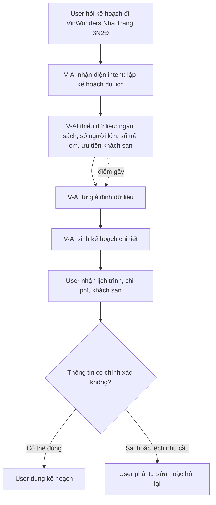
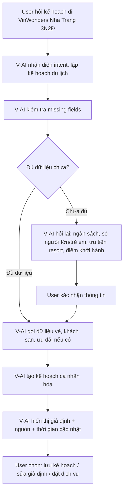
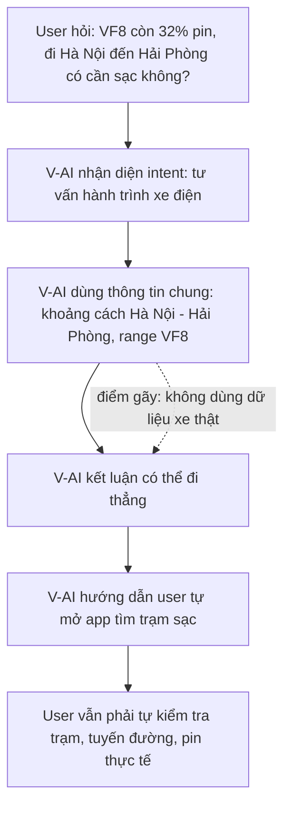
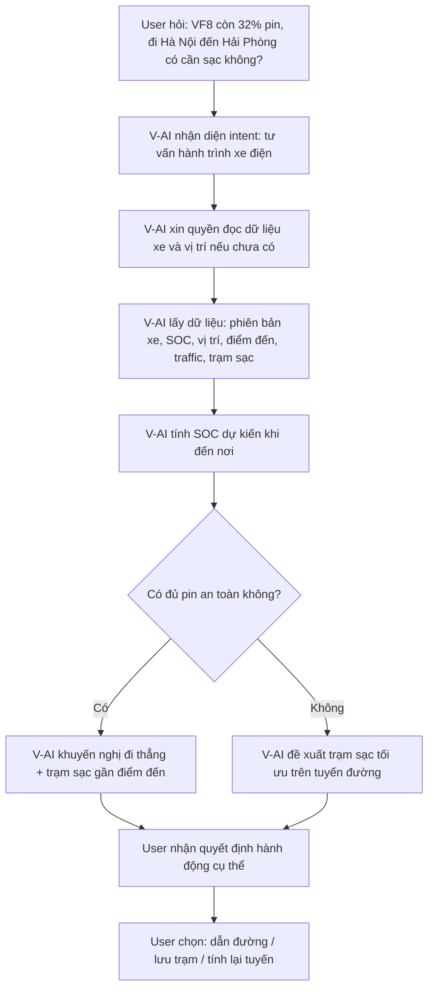
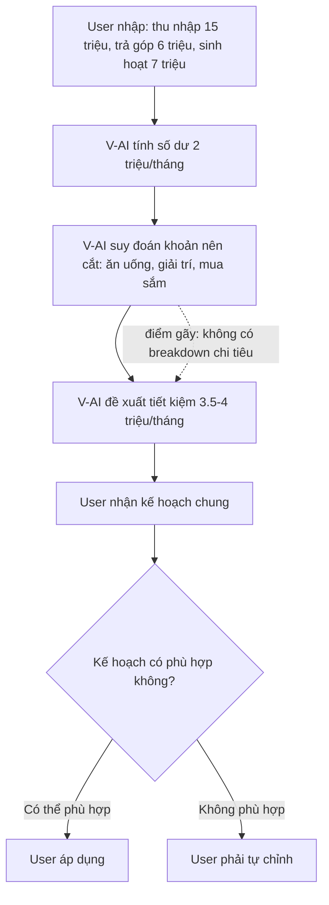
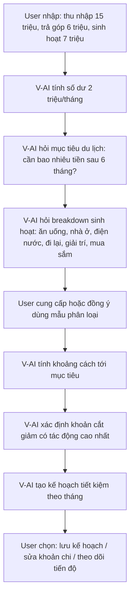
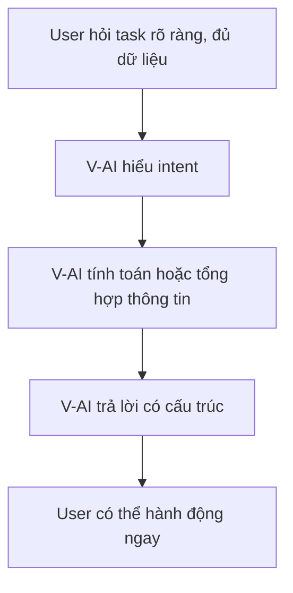
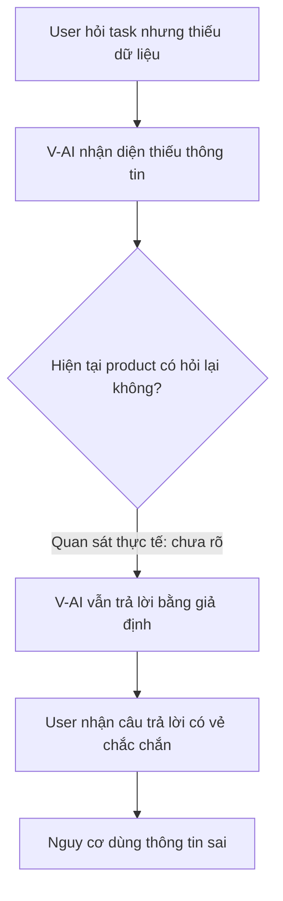
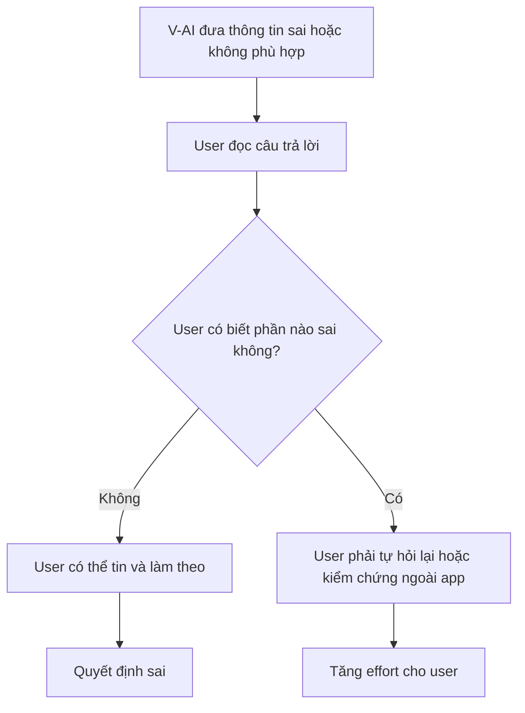
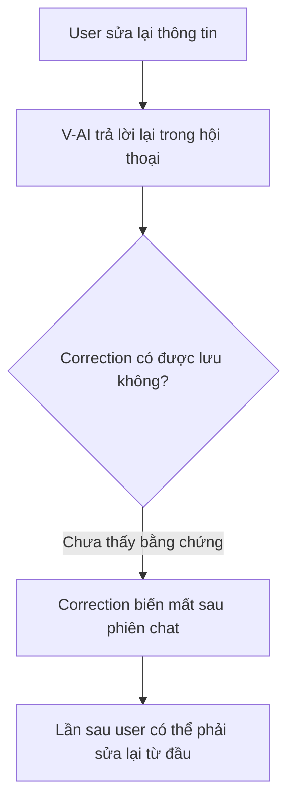

# Workshop — Mổ App AI Thật

**Sản phẩm được chọn:** V-App — V-AI
**AI feature:** Trợ lý voice/text, gợi ý theo ngữ cảnh trong ứng dụng V-App
**Thời gian thực hiện:** 35-45 phút
**Hình thức:** cá nhân trước, chia sẻ theo nhóm sau
**Output:** finding note + sketch `as-is / to-be`

Mục tiêu không phải chấm "UI đẹp hay xấu". Mục tiêu là dùng sản phẩm thật như một bài needfinding: tìm chỗ product gãy trong workflow thật, rồi viết finding đó thành quyết định product.

---

## 1. Chọn một sản phẩm để dùng thử

| Sản phẩm               | AI feature                                     | Cách truy cập       |
| ---------------------- | ---------------------------------------------- | ------------------- |
| MoMo — Moni            | Trợ thủ tài chính, phân tích chi tiêu, chatbot | App MoMo            |
| Vietnam Airlines — NEO | Chatbot hỗ trợ vé, hành lý, khiếu nại          | Website/Zalo VNA    |
| **V-App — V-AI**       | **Trợ lý voice/text, gợi ý theo ngữ cảnh**     | **App V-App**       |
| App theo track nhóm    | App thật nhóm đang chọn cho hackathon          | Cần screenshot/link |

**Sản phẩm được chọn:** V-App — V-AI.

**Lý do chọn:**
V-AI được định vị là trợ lý AI trong hệ sinh thái Vingroup, có khả năng hỗ trợ người dùng bằng voice/text và đưa ra gợi ý theo ngữ cảnh. Vì vậy, kỳ vọng không chỉ là chatbot trả lời kiến thức chung, mà là một trợ lý có thể hiểu tình huống thật, cá nhân hóa theo dữ liệu người dùng và hỗ trợ quyết định trong các dịch vụ liên quan đến Vingroup như VinFast, VinWonders, Vinpearl, Vinhomes, tài chính cá nhân.

---

## 2. Dùng thử: promise vs reality

### 2.1. Product hứa gì?

V-App/V-AI được kỳ vọng là một trợ lý AI có thể:

* Hỗ trợ người dùng bằng hội thoại tự nhiên.
* Đưa ra gợi ý theo ngữ cảnh.
* Hỗ trợ nhiều lĩnh vực trong hệ sinh thái Vingroup.
* Giúp người dùng ra quyết định nhanh hơn trong các tình huống đời sống, di chuyển, du lịch, tài chính, dịch vụ.

### 2.2. User nào được hứa sẽ được giúp?

Nhóm user chính:

* Người dùng V-App.
* Cư dân hoặc khách hàng trong hệ sinh thái Vingroup.
* Chủ xe VinFast.
* Người có nhu cầu sử dụng dịch vụ Vinpearl/VinWonders/Vinhomes.
* Người dùng muốn có trợ lý cá nhân hỗ trợ ra quyết định hằng ngày.

### 2.3. Kỳ vọng AI làm được task nào?

Tôi kỳ vọng V-AI có thể làm tốt các task sau:

1. **Lập kế hoạch du lịch trong hệ sinh thái Vingroup**

   * Gợi ý lịch trình.
   * Đề xuất khách sạn, vé vui chơi, phương tiện di chuyển.
   * Ước tính chi phí.
   * Hỏi lại khi thiếu dữ liệu quan trọng.

2. **Hỗ trợ chủ xe VinFast trong hành trình thật**

   * Ước tính có cần sạc pin hay không.
   * Đề xuất trạm sạc cụ thể trên tuyến đường.
   * Tính toán dựa trên model xe, pin hiện tại, vị trí và điểm đến.

3. **Tư vấn tài chính cá nhân**

   * Phân tích thu nhập, chi phí, khoản dư.
   * Xác định mục tiêu tiết kiệm.
   * Đề xuất khoản cần cắt giảm dựa trên dữ liệu thực tế, không đoán mò.

---

## 2.4. Prompt/input đã thử

### Query 1 — Du lịch VinWonders Nha Trang

```text
Tôi đang ở Ocean Park 2. Cuối tuần này gia đình 4 người muốn đi VinWonders Nha Trang 3 ngày 2 đêm. Hãy giúp tôi lên kế hoạch gồm phương án di chuyển, khách sạn phù hợp cho gia đình có trẻ em 8 tuổi, dự toán chi phí tổng và những thứ cần đặt trước.
```

### Query 2 — VinFast VF 8 Hà Nội đi Hải Phòng

```text
Tôi đang đi VinFast VF 8 từ Hà Nội đến Hải Phòng. Pin còn 32%, dự kiến đến nơi lúc 18h. Hãy cho tôi biết có cần sạc giữa đường không, nên sạc ở đâu, và nếu đến nơi muộn thì có khách sạn nào phù hợp gần trung tâm không.
```

### Query 3 — Kế hoạch tài chính cá nhân

```text
Tôi có ngân sách 15 triệu/tháng. Hiện đang trả góp xe VinFast 6 triệu/tháng, chi tiêu sinh hoạt khoảng 7 triệu/tháng. Tôi muốn tiết kiệm để đi du lịch trong 6 tháng tới. Hãy đề xuất kế hoạch tài chính phù hợp và chỉ ra khoản nào nên cắt giảm.
```

---

## 2.5. Hành vi quan sát được

### Observation 1 — Query du lịch

V-AI hiểu đúng ý định lập kế hoạch du lịch và trả lời có cấu trúc. Tuy nhiên, AI tự suy diễn một số dữ liệu chưa được cung cấp, ví dụ giả định cơ cấu gia đình, loại trẻ em, mức chi phí, gói dịch vụ. AI cũng không hỏi lại các thông tin quan trọng như ngân sách, số người lớn/trẻ em cụ thể, hạng phòng mong muốn, có muốn ở Vinpearl hay không.

**Điểm gãy:** AI trả lời quá tự tin khi dữ liệu đầu vào chưa đủ.

---

### Observation 2 — Query VinFast VF 8

V-AI ước tính rằng 32% pin đủ đi từ Hà Nội đến Hải Phòng. Câu trả lời có tính toán sơ bộ, nhưng chưa tận dụng dữ liệu xe thật như phiên bản VF 8, tình trạng pin thực tế, vị trí hiện tại, tuyến đường, điều kiện giao thông, trạng thái trạm sạc.

**Điểm gãy:** AI trả lời giống chatbot kiến thức chung, chưa thể hiện giá trị của trợ lý nằm trong hệ sinh thái Vingroup.

---

### Observation 3 — Query tài chính cá nhân

V-AI tính đúng khoản dư hiện tại:

```text
15 triệu - 6 triệu - 7 triệu = 2 triệu/tháng
```

Tuy nhiên, AI không biết cấu trúc khoản chi sinh hoạt 7 triệu gồm những gì, nhưng vẫn khuyên giảm ăn uống, giải trí, mua sắm. Đây là lời khuyên có thể đúng nhưng không được chứng minh bằng dữ liệu.

**Điểm gãy:** AI đưa ra lời khuyên tài chính dựa trên giả định, không hỏi mục tiêu du lịch cụ thể và không phân tích chi tiết khoản chi.

---

## 3. Vẽ 4 paths

| Path           | Câu hỏi cần trả lời                                                           | Quan sát trên V-AI                                                                                                        |
| -------------- | ----------------------------------------------------------------------------- | ------------------------------------------------------------------------------------------------------------------------- |
| Happy          | Khi AI đúng và tự tin, user thấy gì?                                          | AI trả lời có cấu trúc, có tính toán, có gợi ý hành động. Ví dụ: tính được dư 2 triệu/tháng trong query tài chính.        |
| Low-confidence | Khi AI không chắc, hệ thống có hỏi lại, show options hoặc chuyển người không? | Chưa thấy low-confidence path rõ ràng. AI thường trả lời thẳng thay vì hỏi lại khi thiếu dữ liệu.                         |
| Failure        | Khi AI sai, user biết bằng cách nào và sửa thế nào?                           | AI có ghi “thông tin có thể thay đổi”, nhưng không chỉ rõ phần nào là chắc, phần nào là giả định. User khó phát hiện lỗi. |
| Correction     | Khi user sửa, correction có được lưu/log/học lại không hay biến mất?          | Chưa thấy bằng chứng rằng correction được lưu lại hoặc dùng để cải thiện lần trả lời sau.                                 |

---

# 4. Finding thành quyết định product

## Finding 1 — AI tự tin khi thiếu dữ liệu

```text
Khi user yêu cầu lập kế hoạch du lịch hoặc tài chính nhưng chưa cung cấp đủ dữ liệu,
AI vẫn tạo câu trả lời chi tiết bằng cách tự giả định thông tin,
hậu quả là user có thể ra quyết định sai về chi phí, lịch trình hoặc kế hoạch tiết kiệm.
Lỗi thuộc layer Intent + Data-tool + UX Recovery.
Nên sửa bằng requirement: trước khi recommend, AI phải kiểm tra missing fields và kích hoạt low-confidence path để hỏi lại hoặc hiển thị các giả định cho user xác nhận.
```

**Product decision:**
Không nên ưu tiên làm câu trả lời dài hơn. Cần ưu tiên cơ chế **clarification before recommendation**: khi thiếu dữ liệu quan trọng, AI phải hỏi lại hoặc cho user xác nhận giả định trước khi đưa ra kế hoạch cuối cùng.

---

## Finding 2 — AI chưa tận dụng ngữ cảnh hệ sinh thái Vingroup

```text
Khi user hỏi về VinFast, VinWonders hoặc tài chính có liên quan đến dịch vụ Vingroup,
AI trả lời chủ yếu bằng kiến thức chung thay vì dùng dữ liệu hệ sinh thái như xe đang dùng, vị trí, pin, ưu đãi, membership, lịch sử dịch vụ,
hậu quả là V-AI chưa tạo ra khác biệt rõ ràng so với chatbot thông thường.
Lỗi thuộc layer Promise + Data-tool.
Nên sửa bằng requirement: AI cần có khả năng gọi tool nội bộ để đọc dữ liệu được user cho phép, ví dụ trạng thái xe, vị trí, ưu đãi, booking, membership.
```

**Product decision:**
V-AI cần được thiết kế như một **context-aware assistant**, không chỉ là chatbot trả lời văn bản. Với các task thuộc hệ sinh thái Vingroup, AI phải ưu tiên dùng dữ liệu cá nhân hóa và dữ liệu thời gian thực.

---

## Finding 3 — Recovery path yếu khi AI sai hoặc user muốn sửa

```text
Khi AI đưa ra kế hoạch sai hoặc chưa phù hợp,
product chưa cho user một cơ chế rõ ràng để sửa, xác nhận, lưu correction hoặc yêu cầu AI tính lại,
hậu quả là correction bị biến mất trong hội thoại và user phải tự kiểm soát lỗi.
Lỗi thuộc layer UX Recovery + Correction Log.
Nên sửa bằng requirement: mỗi câu trả lời có rủi ro cao cần có nút “Sửa giả định”, “Tính lại”, “Lưu preference”, “Báo thông tin sai”.
```

**Product decision:**
V-AI cần có correction loop. User không chỉ chat tiếp, mà phải có cách sửa có cấu trúc để AI cập nhật flow.

---

# 5. Sketch as-is / to-be

## 5.1. Flow 1 — Du lịch VinWonders Nha Trang

### As-is



### To-be



---

## 5.2. Flow 2 — VinFast VF 8 Hà Nội đến Hải Phòng

### As-is



### To-be



---

## 5.3. Flow 3 — Kế hoạch tài chính cá nhân

### As-is



### To-be



---

# 6. Tổng hợp 4 paths cho V-AI

## 6.1. Happy path



**Ví dụ quan sát:**
Trong query tài chính, AI tính đúng số dư 2 triệu/tháng và suy ra nếu giữ nguyên thì sau 6 tháng có 12 triệu.

---

## 6.2. Low-confidence path



**Vấn đề:**
Low-confidence path chưa được thể hiện rõ. AI chưa có thói quen nói: “Tôi cần thêm thông tin trước khi lập kế hoạch chính xác.”

---

## 6.3. Failure path



**Vấn đề:**
AI có cảnh báo chung như “thông tin có thể thay đổi”, nhưng không đánh dấu cụ thể phần nào là chắc chắn, phần nào là giả định.

---

## 6.4. Correction path



**Vấn đề:**
Chưa thấy correction log hoặc preference memory rõ ràng. Product cần cho user biết correction nào được lưu, correction nào chỉ dùng trong phiên hiện tại.

---

# 7. Finding note cuối cùng

## Finding chính

```text
Khi user dùng V-AI cho các task đời sống có rủi ro quyết định như du lịch, hành trình xe điện hoặc tài chính cá nhân,
AI thường trả lời tự tin dù thiếu dữ liệu quan trọng,
hậu quả là user có thể nhận kế hoạch nghe hợp lý nhưng chưa chắc đúng với hoàn cảnh thật.
Lỗi thuộc layer Intent + Data-tool + UX Recovery.
Nên sửa bằng low-confidence path: kiểm tra missing fields, hỏi lại hoặc hiển thị giả định để user xác nhận trước khi đưa recommendation cuối cùng.
```

## Product decision

```text
V-AI không nên chỉ tối ưu để trả lời dài, nhiều thông tin và có vẻ đầy đủ.
SPEC cần bổ sung requirement: trước mọi task cần quyết định cá nhân hóa, AI phải thực hiện bước “context check” gồm:
1. xác định dữ liệu bắt buộc,
2. đánh dấu dữ liệu đang thiếu,
3. hỏi lại hoặc yêu cầu user xác nhận giả định,
4. chỉ đưa recommendation cuối cùng sau khi có đủ dữ liệu hoặc sau khi user chấp nhận dùng giả định.
```

---

# 8. SPEC change đề xuất

## Requirement 1 — Missing field detection

```text
V-AI must detect missing critical fields before giving recommendations in high-impact tasks such as travel planning, EV route planning, and personal finance.
```

Ví dụ:

| Task      | Missing fields cần hỏi                                                       |
| --------- | ---------------------------------------------------------------------------- |
| Du lịch   | ngân sách, số người lớn/trẻ em, ngày đi, ưu tiên khách sạn, điểm khởi hành   |
| Xe điện   | model xe, SOC, vị trí hiện tại, điểm đến, traffic, trạng thái trạm sạc       |
| Tài chính | mục tiêu tiết kiệm, breakdown chi tiêu, khoản cố định/biến đổi, quỹ khẩn cấp |

---

## Requirement 2 — Assumption confirmation

```text
If V-AI must use assumptions, it must show those assumptions before giving the final plan.
```

Ví dụ:

```text
Tôi đang giả định:
- Gia đình có 2 người lớn, 2 trẻ em.
- Ngân sách trung bình.
- Ưu tiên ở gần VinWonders.
Bạn muốn giữ các giả định này hay sửa?
```

---

## Requirement 3 — Tool/data integration

```text
For Vingroup-related tasks, V-AI should prioritize permitted first-party data over generic web-style answers.
```

Ví dụ:

| Tình huống                       | Data/tool nên dùng                                             |
| -------------------------------- | -------------------------------------------------------------- |
| Chủ xe VinFast hỏi về hành trình | dữ liệu xe, pin, GPS, trạm sạc, traffic                        |
| User hỏi VinWonders/Vinpearl     | phòng trống, giá vé, combo, ưu đãi, membership                 |
| User hỏi tài chính               | lịch sử chi tiêu, khoản thanh toán định kỳ, mục tiêu tiết kiệm |

---

## Requirement 4 — Correction loop

```text
V-AI should provide structured correction actions after each recommendation.
```

Nút/action cần có:

- Sửa giả định.
- Tính lại.
- Lưu preference.
- Báo thông tin sai.
- Chuyển sang người hỗ trợ nếu task cần xác nhận chính thức.

---

# 9. Tự kiểm trước khi nộp

- [x] Có ít nhất 1 screenshot hoặc observation cụ thể.
- [x] Có đủ 4 paths hoặc nói rõ path nào chưa có trong product.
- [x] Finding được viết thành product decision, không chỉ là nhận xét.
- [x] Sketch có as-is và to-be.
- [x] Có một câu nói rõ finding này sẽ đổi gì trong SPEC.