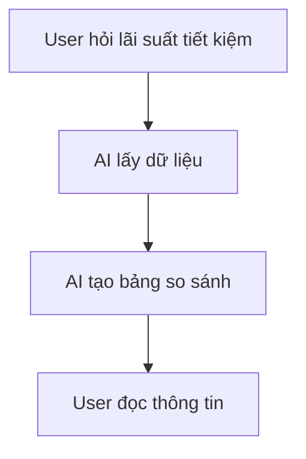
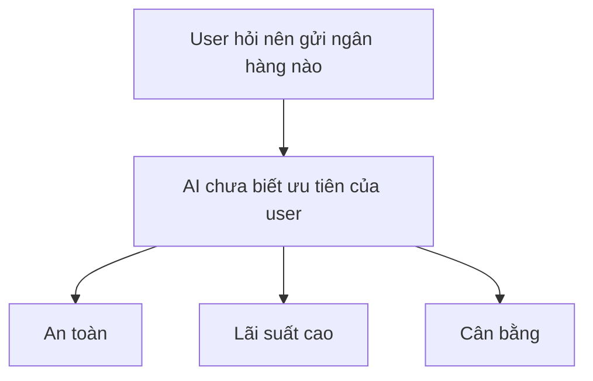
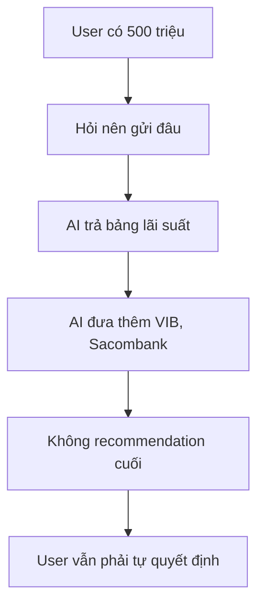
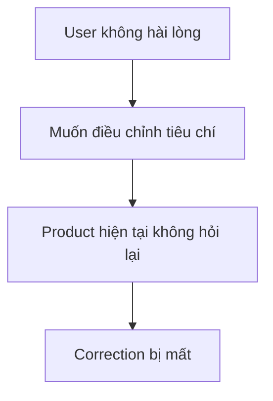
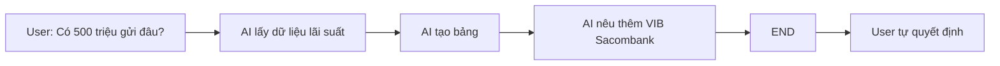
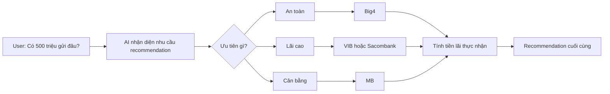

# Workshop — Mổ App AI Thật

**Thời gian:** 35-45 phút

**Hình thức:** cá nhân trước, chia sẻ theo nhóm sau

**Output:** finding note + sketch as-is / to-be

Mục tiêu không phải chấm "UI đẹp hay xấu".

Mục tiêu là dùng sản phẩm thật như một bài needfinding: tìm chỗ product gãy trong workflow thật, rồi viết finding đó thành quyết định product.

---

# 1. Chọn một sản phẩm để dùng thử

| Sản phẩm     | AI feature                             | Cách truy cập |
| ------------ | -------------------------------------- | ------------- |
| V-App — V-AI | Trợ lý voice/text, gợi ý theo ngữ cảnh | App V-App     |

---

# 2. Dùng thử: promise vs reality

## Product hứa gì?

Theo bài viết giới thiệu:

> V-AI là trợ lý AI hỗ trợ người dùng tìm kiếm thông tin, tư vấn và hỗ trợ ra quyết định trong các tình huống thực tế.

## User được hứa sẽ được giúp

- Người dùng phổ thông
- Người cần tra cứu thông tin
- Người cần hỗ trợ ra quyết định nhanh

## Task kỳ vọng AI làm được

Tôi thử tình huống tài chính thực tế:

> So sánh lãi suất gửi tiết kiệm kỳ hạn 12 tháng của 5 ngân hàng lớn hiện nay và đề xuất lựa chọn phù hợp nếu tôi có 500 triệu đồng.

Kỳ vọng:

- So sánh dữ liệu
- Tính toán lợi ích
- Đưa ra recommendation cuối cùng

## Reality

AI:

- Trả bảng lãi suất
- Đưa thêm một số ngân hàng khác ngoài bảng
- Không tính số tiền lãi thực nhận
- Không đưa ra lựa chọn cuối cùng

### Evidence

#### Prompt

```text
So sánh lãi suất gửi tiết kiệm kỳ hạn 12 tháng của 5 ngân hàng lớn hiện nay và đề xuất lựa chọn phù hợp nếu tôi có 500 triệu đồng.
```

#### Observation

Bot trả:

- Agribank: 5.9%
- Vietcombank: 5.9%
- BIDV: 5.9%
- VietinBank: 5.9%-6.8%
- MB: 6.2%

Sau đó lại khuyến nghị:

- VIB: 7.0%
- Sacombank: 6.8%
- Cake by VPBank

Người dùng vẫn phải tự quyết định.

### Điểm gãy

Người dùng hỏi:

> Tôi nên gửi đâu?

AI chỉ cung cấp dữ liệu rời rạc thay vì recommendation có thể hành động được.

---

# 3. Vẽ 4 paths

| Path           | Quan sát                                                                   |
| -------------- | -------------------------------------------------------------------------- |
| Happy          | Có dữ liệu lãi suất, AI trả được bảng so sánh                              |
| Low-confidence | Không thấy AI hỏi thêm về mục tiêu gửi tiền (an toàn hay tối đa lợi nhuận) |
| Failure        | Không đưa ra recommendation cuối cùng dù user đang hỏi để ra quyết định    |
| Correction     | Không có cơ chế sửa hoặc tinh chỉnh recommendation                         |

---

## Happy Path



---

## Low-confidence Path



---

## Failure Path



---

## Correction Path



---

# 4. Viết finding thành quyết định

## Finding

Khi user hỏi:

> Tôi có 500 triệu đồng, nên gửi ngân hàng nào?

AI chỉ tổng hợp dữ liệu lãi suất mà không chuyển đổi thành recommendation cụ thể.

Hậu quả:

- User vẫn phải tự phân tích.
- User không nhận được giá trị hỗ trợ ra quyết định như promise ban đầu.

### Layer

- Intent
- Decision Support
- UX Recovery

### Đề xuất

Bổ sung bước:

1. Nhận diện user đang cần recommendation.
2. Hỏi tiêu chí ưu tiên:
   - An toàn
   - Lãi cao
   - Cân bằng
3. Tính tiền lãi thực nhận.
4. Đưa ra lựa chọn cuối cùng kèm lý do.

---

# 5. Sketch as-is / to-be

## As-is



### Điểm gãy

AI dừng ở mức cung cấp thông tin.

Không hoàn thành nhiệm vụ hỗ trợ ra quyết định.

---

## To-be



### Path đã sửa

- Low confidence path
- Decision path
- Recommendation path

---

# 6. Tự kiểm trước khi nộp

- [x] Có observation cụ thể.
- [x] Có prompt thực tế.
- [x] Có đủ 4 paths.
- [x] Có finding dưới dạng product decision.
- [x] Có sketch as-is và to-be.
- [x] Có đề xuất thay đổi SPEC.

## Thay đổi trong SPEC

Thêm requirement:

> Nếu user hỏi theo dạng "nên chọn gì", "nên làm gì", "đề xuất phương án", AI phải chuyển từ chế độ trả dữ liệu sang Decision Support Flow, bao gồm:
>
> - xác định tiêu chí quyết định,
> - lượng hóa lợi ích,
> - recommendation cuối cùng,
> - giải thích lý do lựa chọn.
